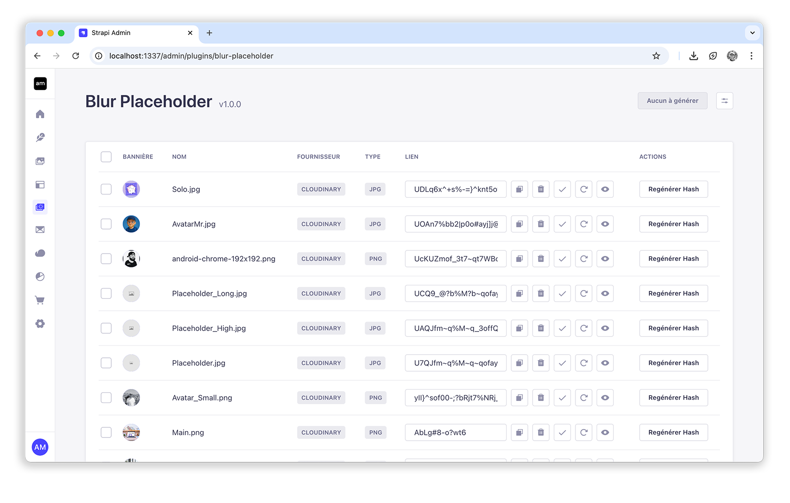
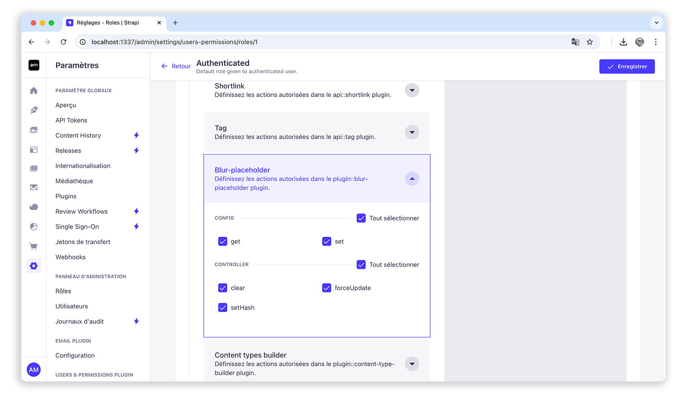

<div align="center">
  
  <h1>Blur Placeholder</h1>
  <p>The Strapi plugin for generating your placeholders</p>
  
</div>

**Version:** 1.0.0  
**Compatible with Strapi:** ≥ 5.14.0  
**License:** MIT  
**Free and open-source**

*French documentation available here:  
[Français disponible ici](README.fr.md)*

## 🖼️ Overview

The **Blur Placeholder** plugin adds a modern user experience layer to your front-end sites by automatically generating blurred placeholders for your images.

These placeholders are embedded directly in the JSON response of your media via a new `blurhash` field. This enables progressive and smooth image loading on your site, optimizing load times and user perception.

The plugin is **compatible with both the local and Cloudinary providers**.

## ✨ Features

- 🔄 **Automatic blurhash generation** on:
  - Server startup (for existing media without a hash)
  - Upload of new media

- ⚙️ **Configuration interface**:
  - New tab in the admin panel: `Blur Placeholder`
  - Choose your algorithms and provider
  - Apply settings to all media with one click

- 🧩 **Individual media management**:
  - View, manual edit, and generate on a case-by-case basis

- 🌍 **Multi-language support** (initial)

- 🤝 **Open to contributions** (see contact below)

## 🔧 Technologies used

The plugin supports several placeholder generation methods:

- [LQIP (Low Quality Image Placeholder)](https://github.com/zouhir/lqip)
- [Blurhash](https://blurha.sh)
- [Color Thief](https://lokeshdhakar.com/projects/color-thief/)
- [SQIP (SVG-based LQIP)](https://github.com/axe312ger/sqip)

## 📦 Installation

```bash
npm install strapi-plugin-blur-placeholder
or
yarn add strapi-plugin-blur-placeholder
```

Don’t forget to restart or rebuild your Strapi application after installing a new plugin.

## 🧰 Configuration

Once installed:

1. Go to the **Blur Placeholder** tab in the admin panel

2. Choose your generation settings (type, quality, etc.)

3. Apply settings globally or manage media individually

No manual file configuration is needed.

<div align="center">
  
</div>

## ✅ Compatibility

- Strapi v5.14.0 or newer  
- Local provider  
- Cloudinary provider  

## 📧 Contact & Contributions

Improvements, bugs, or ideas? Contact me:

- Email: contact@michelaxel.fr  
- Website: michelaxel.fr  
- Contributions welcome via PRs or issues on the GitHub repository  

## 📄 License

This plugin is distributed under the MIT license. Free and open use.
